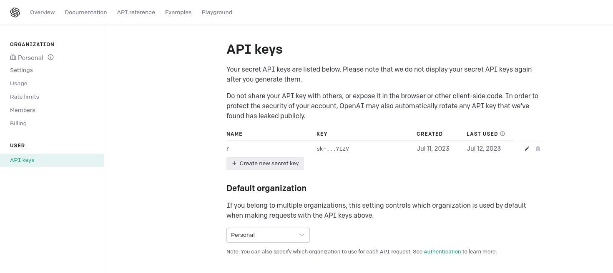
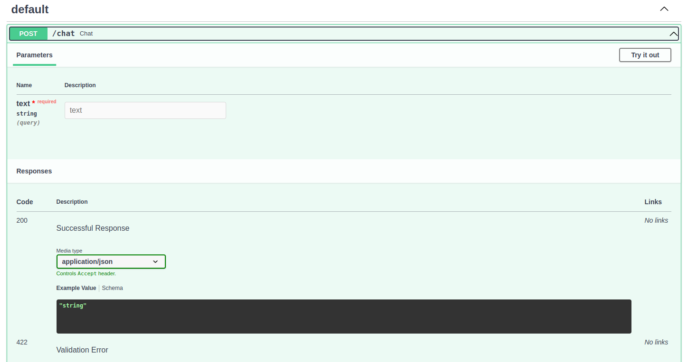

# Super intelligent chatbot

This project aims at providing an API endpoint for answering questions from a CSV file.
Assumes that you are the owner of a small shop, and you want to have a chatbot available
to answer questions from your data source, this is for you.

## How-to Guide

### 1. Create an OpenAI API token

After registering your account, navigate to https://platform.openai.com/account/api-keys and click on `Create new secret key`.



When you have already created your key, update your `.env.example` file to replace my key.

### 2. Run the API

```shell
conda create -n text2sql
conda activate text2sql
conda install --file requirements.txt

set -a && source .env.example && set +a
uvicorn main:app --host 0.0.0.0 --port 8081
```

Open your browser and access this address `localhost:8081/docs` to access API doc (Swagger UI).

### 3. Enjoy your API

There are two routes in the Swagger UI:

- `/chat`: Press `Try it out`, then enter `Show me the image link of Hisense 4K ULED Fire TVs?` in the `text` and press `Execute`
  

- `/chat-auth`: Press `Try it out`, then enter `username`: `quandv` and `password`: `bQeUYlfCyITO` to authenticate.
  After that, enter the text as the `/chat` route.
